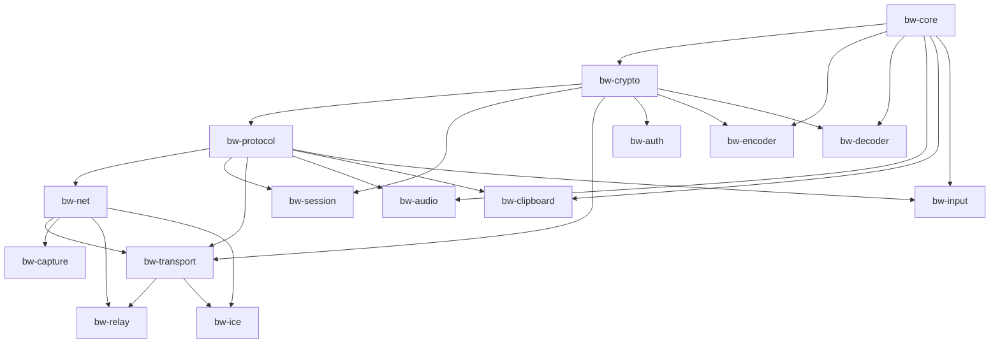

# BLACKWING

**BLACKWING** — Zero-trust, low-latency remote desktop platform built in Rust.

> **Current state (2026-09-03):** 17 workspace crates, full remote-desktop vertical slice (capture → encode → transport → decode → display, plus input injection, clipboard sync, audio streaming, ICE, and relay/NAT traversal). Security hardening phases C1–C3, H1, L-K1, H3, H5/H6, M1/M2/M3/M6 are complete. F3 (relay polling lifecycle) is CLOSED.
>
> The canonical project-state document is [`BLACKWING_SOURCE_OF_TRUTH.md`](BLACKWING_SOURCE_OF_TRUTH.md). Read it before changing code.

---

## Architecture Overview

Crate dependency flow (17 crates; dependency direction is strictly enforced):



| Crate | Responsibility |
|-------|----------------|
| `bw-core` | Error registry, lock-free memory pools, logging primitives |
| `bw-crypto` | Ed25519 identity, ChaCha20-Poly1305 AEAD, HKDF, HMAC-SHA256 |
| `bw-protocol` | Packet header, frame codec, CBOR messages, routing, dispatcher, DRR scheduler, encryption, reliability, handshake, session management |
| `bw-net` | UDP transport baseline (historical, superseded by `bw-transport`) |
| `bw-session` | Session lifecycle, secure connection (OPAQUE-authenticated) |
| `bw-transport` | QUIC client/server (quinn), certificate management, ICE socket binding, `RelayUdpSocket` |
| `bw-auth` | OPAQUE PAKE authentication (RFC 9381) |
| `bw-capture` | DXGI/WGC screen capture (Windows), cursor tracking, frame timer |
| `bw-encoder` | OpenH264 H.264 encoder pipeline |
| `bw-decoder` | OpenH264 H.264 decoder pipeline |
| `bw-relay` | Relay server, forwarding, rendezvous, NAT traversal, rate limiting |
| `bw-ice` | ICE/STUN agent (wraps `webrtc-ice`) |
| `bw-input` | Win32 SendInput injection, keyboard/mouse mapping |
| `bw-clipboard` | Bidirectional clipboard polling, text/image roundtrip (arboard) |
| `bw-audio` | Opus audio capture/playback (cpal) |
| `bw-client` | Desktop client application (winit rendering loop, video decode, input capture) |
| `bw-server` | Host server application (dispatcher, input injection, audio, clipboard, cursor compositing) |

---

## Prerequisites

- Windows 10/11 (DXGI capture requires Windows)
- Rust stable, GNU toolchain: `rustup target add x86_64-pc-windows-gnu`
- MinGW: `scoop install mingw`

---

## Build Instructions

```bash
cargo build
cargo test --workspace
```

---

## Quality Gates

```bash
cargo fmt --check
cargo clippy --workspace --all-targets --all-features -- -D warnings
cargo test --workspace
cargo build --release
```

All gates must pass before any work package is tagged complete. See [`BLACKWING_SOURCE_OF_TRUTH.md`](BLACKWING_SOURCE_OF_TRUTH.md) §23 for the full verification set.

---

## Work Package History

See [`WP_CHANGELOG.md`](WP_CHANGELOG.md) for the complete chronological record. Summary:

| WP | Delivered | Tag |
|----|-----------|-----|
| WP-3.1 – 3.7 | `bw-core` bootstrap: error registry, logging, memory, slot pool, zero-allocation buffers | `wp-3.1-complete` … `wp-3.7-complete` |
| WP-4.1 – 4.11 | `bw-protocol`: header, frame codec, messages, encryption, reliability, handshake, routing, dispatcher, DRR scheduler, session integration | `wp-4.1-complete` … `wp-4.10-complete` |
| WP-5.0 | `bw-net` bootstrap, UDP transport, receive loop | `wp-5.0-complete` |
| WP-6.0 – 6.2 | QUIC transport, protocol adapter, secure connection lifecycle | `wp-6.2-complete` |
| WP-7.0 | Capture phase (DXGI/WGC) | `wp-7.0-complete` |
| WP-8.0 Phases 1–4 | Relay signaling, rendezvous, NAT traversal, forwarding, transport integration | `wp-8.0-phase2/3/4-complete` |
| WP-9.0 | H.264 video encoding (OpenH264) | `wp-9.0-complete` |
| WP-10.0 | Full-stack integration: input, clipboard, audio, ICE, client/server apps | (no tag) |
| OPAQUE Auth | Password-authenticated key exchange (RFC 9381) | `wp-opaque-auth` |
| Security hardening | C1/C2/C3, H1, L-K1, H3, H5/H6, M1/M2/M3/M6 (+ M7/M8 verified) | — |
| Phase 3 validation | 59 adversarial tests, 0 findings | — |
| F3 | Relay polling lifecycle — async, cancellation-safe, deterministic tests | — |

---

## Security Model

- Ed25519 identity (DeviceId = SHA-256 of Ed25519 public key, `bw-id-{hex64}`)
- ChaCha20-Poly1305 AEAD with HKDF key derivation and automatic key rotation (`Counter(10_000)`)
- OPAQUE PAKE authentication (RFC 9381, ristretto255) — password never leaves either peer
- Zero-knowledge relay (relay never sees session keys)
- QUIC transport via quinn (double encryption by design)
- Certificate pinning: client verifies the server certificate SPKI against the expected DeviceId
- Production fails closed; `--dev-insecure` (SkipServerVerification) is explicit opt-in for development only

---

## Known Limitations

- Windows-only (DXGI capture, Win32 SendInput FFI)
- Production QUIC tuning not yet performed (default quinn configuration)
- Cursor bitmap rendering not implemented (crosshair overlay only)
- WGC capture backend is a skeleton
- DXGI Desktop Duplication allows one capture per output (no multi-client session yet)
- TPM hardware security module is a stub (`unimplemented!()` in TPM backend — variant unreachable in normal paths)
- CI workflow (`.github/workflows/ci.yml`) exists but is a stale skeleton awaiting completion
- No file transfer, no multi-monitor selection