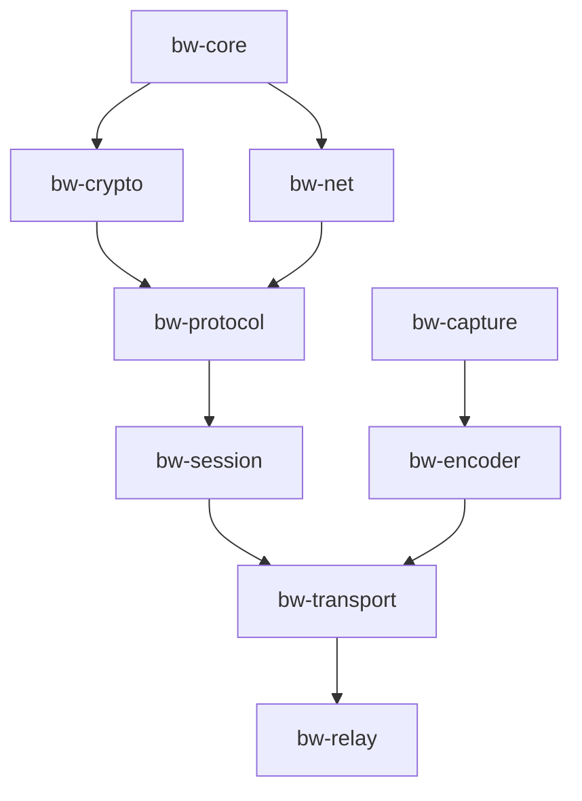

# BLACKWING

**BLACKWING** — Zero-trust, low-latency remote desktop platform built in Rust.

---

## Architecture Overview

Crate dependency map (9 crates):



| Crate | Responsibility |
|-------|----------------|
| `bw-core` | Error registry, lock-free memory pools, logging primitives |
| `bw-crypto` | Ed25519 identity, ChaCha20-Poly1305 AEAD, HKDF |
| `bw-net` | UDP transport baseline (historical, superseded by `bw-transport`) |
| `bw-protocol` | Packet header, frame codec, handshake, messages, routing, dispatcher, DRR scheduler |
| `bw-session` | QUIC-based secure connection lifecycle (OPAQUE-authenticated) |
| `bw-transport` | Quinn 0.11 QUIC client/server + `RelayUdpSocket` |
| `bw-capture` | DXGI/WGC screen capture (Windows) |
| `bw-encoder` | OpenH264 H.264 encoder pipeline |
| `bw-relay` | Relay signaling, rendezvous, zero-knowledge forwarding |

---

## Prerequisites

- Windows 10/11 (DXGI capture requires Windows)
- Rust stable, GNU toolchain: `rustup target add x86_64-pc-windows-gnu`
- MinGW: `scoop install mingw`

---

## Build Instructions

```bash
cargo build
cargo test --all-targets
```

---

## Quality Gates

```bash
cargo fmt --check
cargo clippy --all-targets -- -D warnings
cargo test --all-targets
```

All three must pass before any work package is tagged complete.

---

## Work Package History

| WP | Delivered | Tag |
|----|-----------|-----|
| WP-3.1 – 3.7 | `bw-core` bootstrap: error registry, logging, memory, slot pool, zero-allocation buffers, API stabilization | `wp-3.1-complete` … `wp-3.7-complete` |
| WP-4.1 – 4.7 | `bw-protocol`: crate bootstrap, version/header, frame codec, handshake & capability negotiation, message layer, routing/session | `wp-4.1-complete` … `wp-4.7-complete` |
| WP-4.9 – 4.10 | Quality gate hardening; session integration and security hardening | `wp-4.9-quality-gate`, `wp-4.10-complete` |
| WP-5.0 | `bw-net` bootstrap, session orchestration, integration tests, ADRs | `wp-5.0-complete` |
| WP-6.0 – 6.2 | QUIC transport, protocol adapter, secure connection lifecycle | `wp-6.2-complete` |
| WP-7.0 | Capture phase (DXGI/WGC) | `wp-7.0-complete` |
| WP-8.0 Phase 1–2 | Relay signaling, registration, rendezvous & NAT traversal | `wp-8.0-phase2-complete` |
| WP-8.0 Phase 3 | Relay forwarding (`ForwardingTable`, `RelayUdpSocket`), quotas & expiry | `wp-8.0-phase3-complete` |
| WP-8.0 Phase 4 | Transport integration, E2E relay test, workspace lint enforcement | `wp-8.0-phase4-complete`, `wp-8.0-phase4-transport-integration` |

---

## Security Model

- Ed25519 identity (DeviceId = SHA-256 of public key)
- ChaCha20-Poly1305 AEAD with HKDF key derivation
- OPAQUE PAKE authentication (RFC 9381, ristretto255) — password never leaves either peer
- Zero-knowledge relay (relay never sees session keys)
- QUIC transport via quinn 0.11 (double encryption by design)

---

## Known Limitations

- TLS cert verification disabled (dev mode — `SkipServerVerification`)
- No input/clipboard/audio yet
